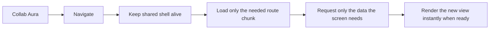

# 102033 · Collab Aura - Master Frontend

Part of **collab.codes**.

`102033` is **Collab Aura**, the master frontend for the Collab model: a
frontend platform built to deliver responsive, modular, fast-loading
applications with a cleaner user flow and better control over interactions.

> Collab Aura is designed for teams that want a frontend they can grow with:
> responsive, route-aware, BFF-oriented, interaction-safe, and ready to deliver
> a smoother experience without turning the UI into a maze of duplicated
> requests and fragile page logic.

## Why teams choose Collab Aura

#### Collab Aura is built for high-performance business systems.

It is designed for operational applications, internal platforms, dashboards,
transactional workflows, and data-driven interfaces where responsiveness,
control, and consistency matter. **It is not intended for marketing websites**,
landing pages, or other content-first experiences where a simpler rendering
model is usually a better fit.

Many frontend applications become noisy over time:

- too many backend calls for a single screen
- repeated loading flows
- duplicated user actions
- confusing navigation logic
- poor mobile adaptation
- fragile transitions between pages

Collab Aura is designed to solve that with a more intentional frontend model.

## Collab Aura Highlights

### BFF-oriented by design

Collab Aura follows the **Backend for Frontend** approach.

Instead of making many scattered calls from the browser and forcing the UI to
assemble everything on its own, the frontend requests exactly what the screen
needs in a more focused way.

That means:

- fewer unnecessary round trips
- cleaner screen loading logic
- less frontend orchestration noise
- a UI that asks for what matters instead of stitching together many partial
  responses

In practice, one well-structured request can replace several smaller calls and
make the experience easier to optimize and easier to reason about.

### Responsive by default

Collab Aura is built with responsive rendering in mind.

- pages are designed to adapt across screen sizes
- the model already supports dedicated mobile layouts
- mobile-specific screens can be introduced without changing the core frontend
  architecture

### Protected user interactions

One of the most important UX and data-safety features in Collab Aura is
**submission control**.

When the user starts an action that sends data to the server:

- the interface blocks additional triggering actions
- duplicate clicks are prevented
- repeated key-driven submissions are prevented
- the UI waits for the response before allowing another competing action

This protects both the user experience and the data layer. It reduces duplicate
server calls, avoids repeated operations, and helps prevent the kind of
inconsistent state that often appears when users click again because a response
feels slow.

### SPA advantages, without the usual chaos

Collab Aura uses an SPA model where it actually helps:

- smoother navigation
- faster page transitions
- route-level lazy loading
- already-loaded screens can return instantly
- shared shell behavior across flows

The result is a frontend that feels lighter and more continuous, without forcing
every page into a full reload.

### PWA-ready structure

Collab Aura also supports a PWA-oriented model, which is important for teams
that want a more app-like experience.

Benefits include:

- stronger installable-app potential
- more controlled shell behavior
- a better foundation for mobile-like user journeys
- a cleaner path for future offline-oriented or resilient interaction strategies

### Only load what is needed

Collab Aura is built around route-level lazy loading.

- each route can be split into its own chunk
- shared code can be reused without shipping everything up front
- previously loaded chunks can be reused instantly
- returning to a route does not need to repeat the full loading experience

That helps improve perceived speed and keeps the initial load leaner.

## Traditional server-rendered flow vs Collab Aura

This is one of the biggest practical advantages of the model: the application
keeps its structure alive while changing only what the user actually needs next.

## Experience advantages

Collab Aura was built to improve both user perception and operational
consistency.

- **Faster-feeling navigation**: because the whole page does not need to restart
  every time.
- **Cleaner data flow**: because the frontend asks for focused payloads instead
  of building screens from many scattered requests.
- **Safer actions**: because duplicate submissions and overlapping actions are
  controlled.
- **More reliable UX**: because loading, timeout, retry, and error patterns are
  shared instead of improvised screen by screen.
- **Better long-term maintainability**: because navigation, layout, and
  interaction behavior live in one frontend model.

## What this project includes

Collab Aura currently includes:

- shared application shell
- SPA and PWA entry templates
- route manifest support
- route-level lazy loading
- chunk reuse after first load
- route revisit optimization
- shared navigation orchestration
- global busy guard for user-triggered actions
- two-stage loading feedback
- timeout and retry handling
- shared content-level error handling
- responsive layout foundation
- support for dedicated mobile rendering paths

## Why this matters for companies

Companies do not only want beautiful screens. They want frontend systems that
stay fast, understandable, and safe as the product becomes larger.

Collab Aura helps with that by combining:

- a cleaner interaction model
- better request discipline
- stronger navigation behavior
- a responsive-first mindset
- a frontend architecture ready to scale

## Support

If you need help, please open a **GitHub Issue** in the repository that contains
this project.

Helpful issue details:

- the affected route or screen
- what the user did
- expected behavior
- actual behavior
- browser and OS
- console errors
- screenshots or recordings when available

## Notes for adopters

Collab Aura is intended to be a reusable frontend platform layer. It should stay
focused on shell behavior, navigation, interaction patterns, and rendering
strategy, while product-specific business UI belongs in client modules built on
top of it.
